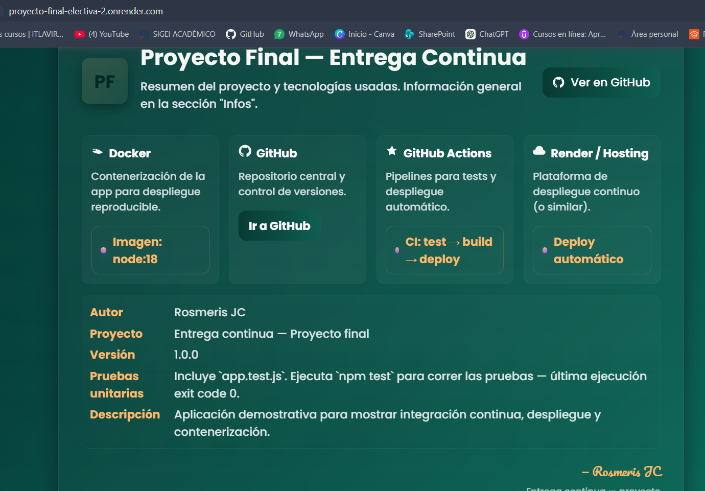
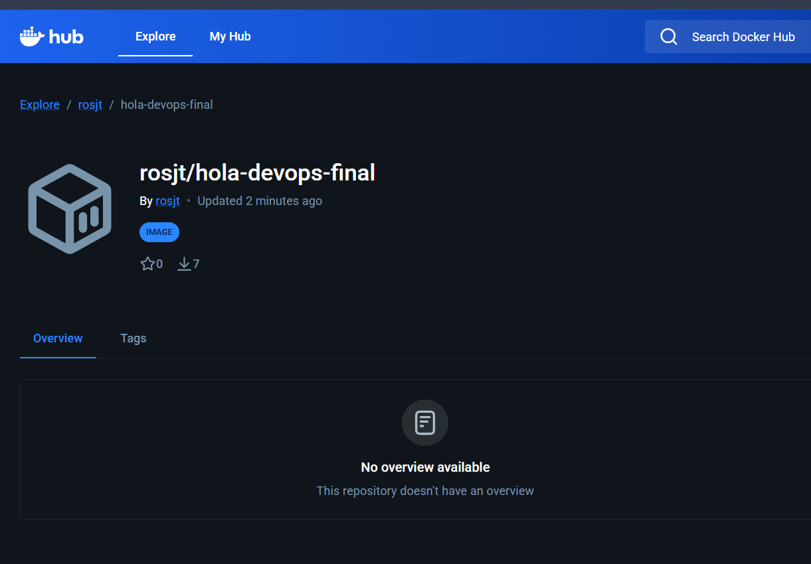
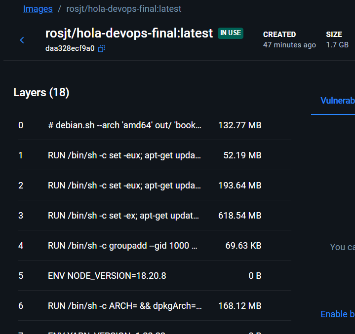
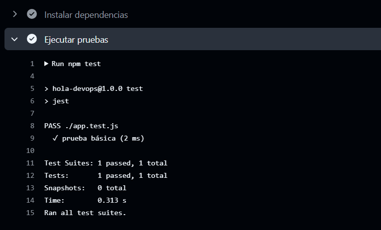

# 2024-1779

# ------------ Proyecto final ----------------

#### Este es el proyecto final de electiva 2:

Practica Final Devops CI/CD con Github..

En esta practica vamos a realizar un poco de todo lo aprendido en el curso. Debe de realizar lo siguiente:

1- Crear repositrio git con una aplicacion web hola mundo en cualquier lenguaje de programacion.

2- Crear prueba unitaria para la aplicacion

3- Crear archivo Dockerfile para ejecutar la aplicacion en Docker

3.- Crear github actions que haga lo siguiente al hacer push a github:

- Instale dependencias
- Ejecute la prueba unitaria
- Suba la imagen de docker a Docker Hub
- Publique la aplicacion en produccion (render o cualquier otro servicio)

## Render> --> https://proyecto-final-electiva-2.onrender.com

## imagen: --> https://hub.docker.com/r/rosjt/hola-devops-final

## action --> https://github.com/Rosme-J227/Proyecto-final---electiva-2-/actions/runs/24913490063/job/72960385344

